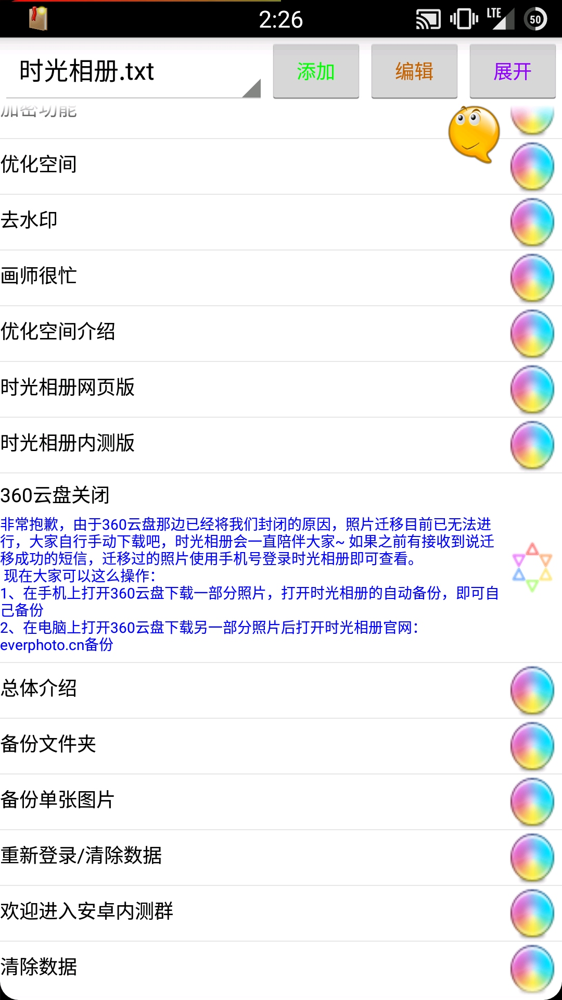
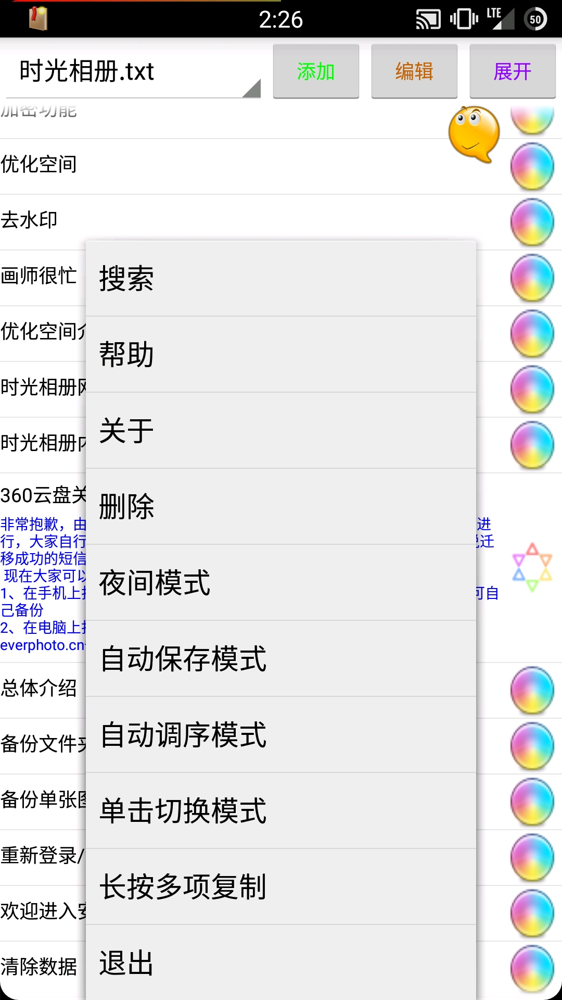
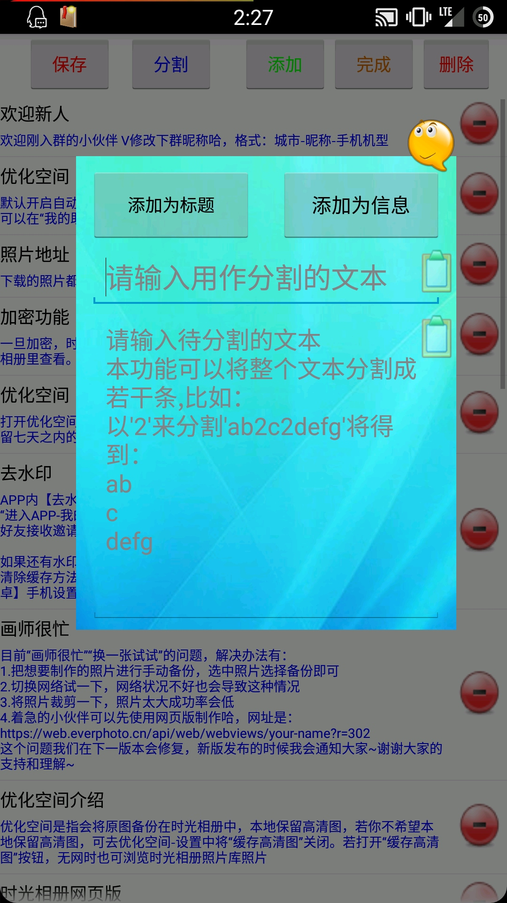

快捷复制
===

## 先听我碎碎念吧

这是我真正开发的第一款 Hello World 软件，其实就是个常用语快速复制，也可以用来保存文字。

刚接触编程的时候，还天真的以为所有的代码都能用中文写，然后入了 E4A 这个坑。其实当时连循环都不怎么会，也没人教，网上也搜不到相对应的解释，全都是直接看中文代码，自己傻乎乎一个个摸索出来的。

虽然坑点无数，但是同样简单，看看就会了，也从此开启了我漫长而又艰苦的学习之路。

“快捷复制”是为了能够在聊天时输入固定的文本而开发的一款软件，不过现在来说已经完全过时了，有好多好用的工具已经能完全取代它，甚至输入法自带常用语并且不需要复制，而我也没有理由继续优化（说实话，改进不来……）

就放着纪念一下吧。

截图里的，还是我远在做时光相册客服的时候放上去的话术……

## 功能

- 保存文字，点一下就复制
- 连续添加、从剪贴板添加、批量添加
- 批量编辑/删除
- 一键展开/折叠内容（只显示标题）
- 多个文档，支持切换
- 悬浮窗进出界面，聊天/资料专用
- 支持点击悬浮窗直接复制下一条常用语，适合广告对话

## 截图

